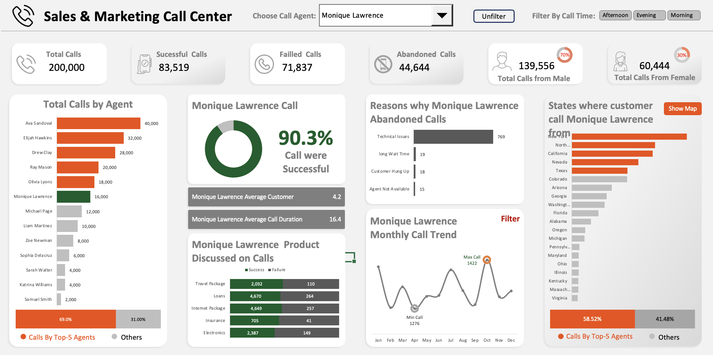

# 📞 Sales & Marketing Call Center Dashboard  
*Interactive Excel Dashboard for Call Performance, Agent Productivity & Customer Insights*

---

## 🧭 Project Overview

This Excel-based dashboard visualizes call center performance metrics across multiple agents, time periods, and call outcomes. It enables data-driven decision-making by providing dynamic filtering, agent-specific KPIs, and abandonment analysis — all within a single interactive dashboard.

### 🔍 Goals of the Project

- Track agent-level performance for successful, failed, and abandoned calls
- Monitor call trends over months and identify performance bottlenecks
- Visualize customer interest across various product types
- Filter results dynamically by agent and time of day (Morning, Afternoon, Evening)
- Display geographic and chart-based views of customer origin

---

## 📊 Key Visualizations & Features

- **KPI Cards** for:
  - Total Calls, Successful Calls, Failed Calls, Abandoned Calls
  - Gender-based call distribution
- **Interactive Filters**:
  - Call Agent Selector (Dropdown)
  - Time-of-Day Filter (Morning / Afternoon / Evening Slicers)
  - "Unfilter" button to reset views
- **Visual Components**:
  - Total Calls by Agent (Bar Chart)
  - Success Rate (Donut Chart)
  - Monthly Call Trend (Line Chart)
  - Reasons for Abandoned Calls (Bar Chart)
  - Product-wise Success/Failure Matrix
  - Geographic Map and Bar Chart Toggle (Customer Locations)

---

## 🧰 Tools & Techniques Used

- **Microsoft Excel**
- Advanced formulas: `XLOOKUP`, `VLOOKUP`, `TEXTJOIN`, `OFFSET`, `MATCH`, `IF`, `SUM`
- **Pivot Tables** and **Pivot Charts**
- Data Validation Dropdowns and Slicers
- Named Ranges for dynamic visual toggles
- Conditional Formatting for success indicators
- Button-driven toggling between charts/maps

---

## 📁 Files Included

| File Name                                                  | Description                                          |
|------------------------------------------------------------|------------------------------------------------------|
| `Sales and Marketing Call Center.xlsm`                     | Final interactive Excel dashboard                    |
| `Sales_and_Marketing_Call_Center_Dashboard_Screenshot.png` | Dashboard preview image                              |
| `README.md`                                                | This documentation file                              |

---

## 📌 How to Use

1. Clone or download this repository.
2. Open `Sales and Marketing Call Center.xlsm` using **Microsoft Excel** (desktop recommended).
3. Use dropdown to select a **call agent**, and slicers to filter by **time of day**.
4. Explore KPIs, abandonment reasons, product-level performance, and call distribution.
5. Use the toggle to switch between **geographic map** and **bar chart** view.

---

## 🧑‍💼 Ideal Use Cases

- Call center operations & performance monitoring
- Agent productivity tracking for managers
- Service improvement analysis
- Product engagement insight

---

